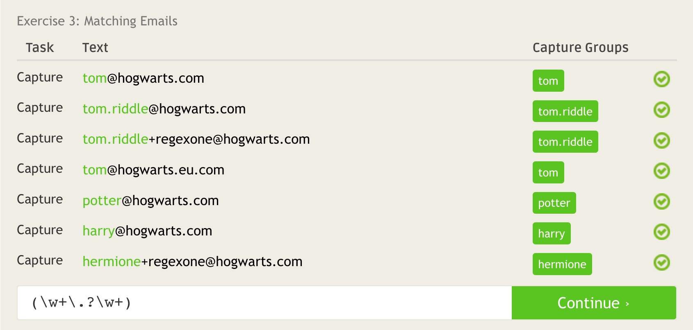
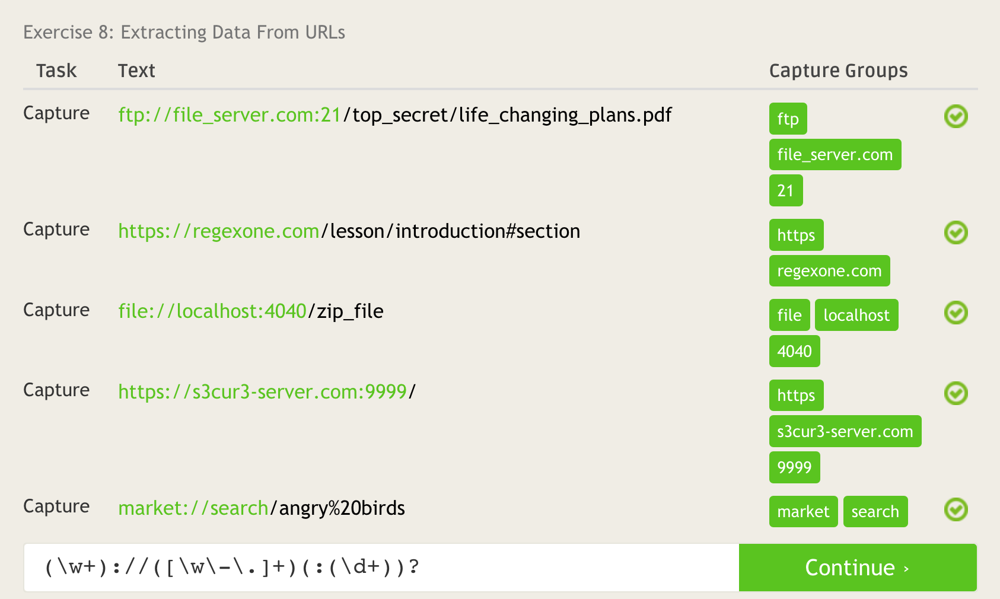
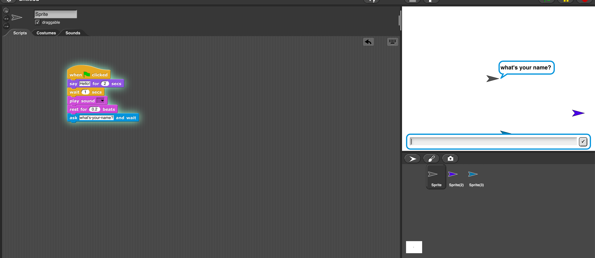

# C.
### Question 1.
The distinction between open and closed source software lies in that open source software is held to a higher standard of transparency and quality.
### Question 2.
- Do not get overly involved in teaching as opposed to finding resources.
- Respondly promptly pays it forward for when you are stuck.
### Question 3.
Jesse was a victim of a vindictive and greedy industry. Software is plagued by this sort of squabbling that inhibits true innovation.  When software is open source, none of those strings are attached.  I feel that the innovation put forward by Jesse is akin to that of Google or Facebook. His technology improved the lives of students but was miused. This is an unfortunate reality of developers who take steps that push boundaries.
# D.

# E.

# F.

# G.
LernaJS is an incredibly useful open source project that I use to manage complex libraries.  It ensures that co-dependencies line up and that you avoid circular dependencies.  Each release of your software will have strong code-contracts especially when using TypeScript with compile-time validation.  Another student and I would like to write a serial library for digital radios. No such library currently exists.