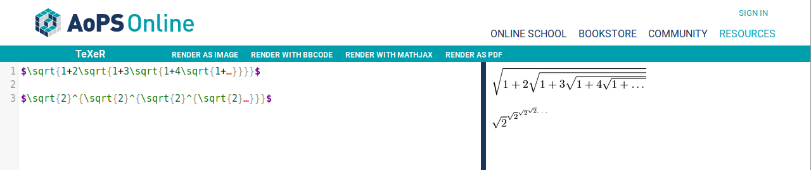
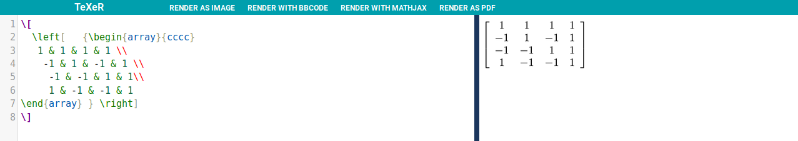

### Part 0 - Documentation
1. [Interest Wiki](https://github.com/ashapir0/csci-open-source-software/wiki/Interests)

2. 
3. 

### Part 1 - Community
#### 1. Project selection
1. [AutoGrading](https://rcos.io/projects/huimingcheng/autograding)
2. There has been 12 contributors.
3. 
    - 761093 Lines of code have been contributed based on wc.
    - [First Commit](https://github.com/HuimingCheng/AutoGrading/commit/b1b4078cba4e1b682c7e636a207768d1bf628d10)
    - [Last Commit](https://github.com/HuimingCheng/AutoGrading/commit/762d6e06aac1050c9b6f3a47fddeb6e3ed828ee4)
    - One branch (master).

#### 2. Gitstats
Compared to the other projects in our this project is on the older and larger side of things. With a high number of authors the most active of which are Hubert51 and Ruijie Geng.  It seems these authors are longtime maintainers of the project.

[AutoGrading Visualized](https://youtu.be/0wFrWGZTeTU)
### Part 2

[Test](./test_markdown_unittest.py)
[MD](./markdown.py)
