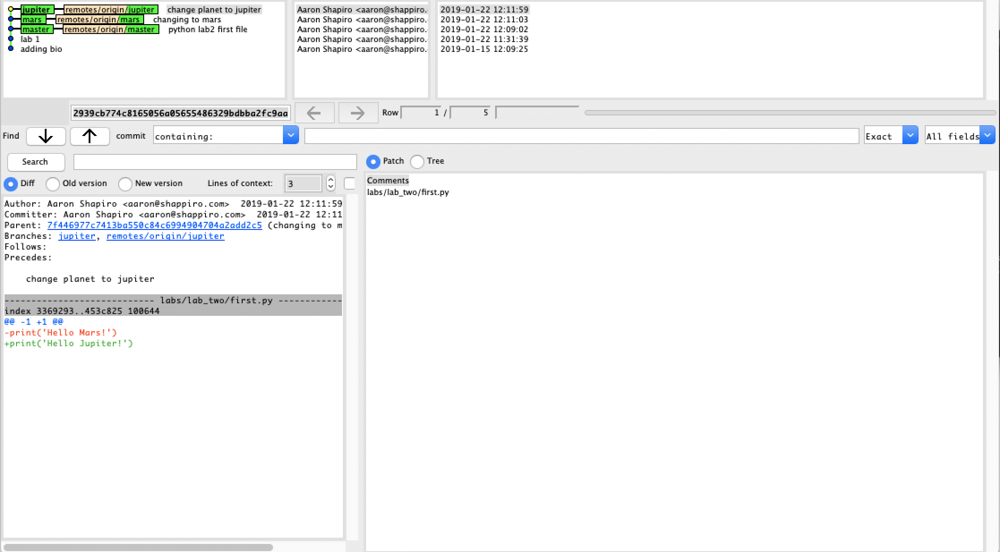
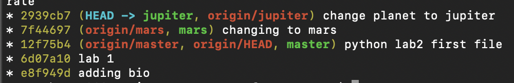
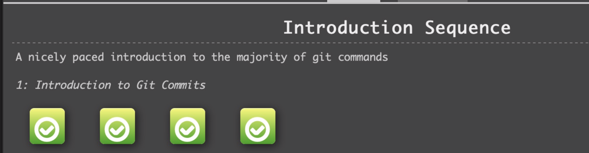

# Part I
#### Git K:

#### Git Log:

# Part II:
[Forked URL](https://github.com/ashapir0/Spoon-Knife)

# Part III:
[Forked URL w/ Pull Request](https://github.com/ashapir0/PullReq)
[Coursework Repository](https://github.com/ashapir0/csci-open-source-software)